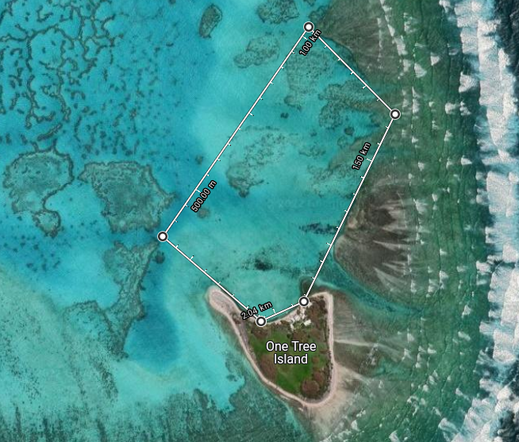

# Aim
Investigate transport of dissolved O2 into the main lagoon through the gutter. This will involve measuring variation in O2:
    * in the lagoon in both isolated and non isolated gutter
    * along the gutter on inflow and outflow

# Method
## Gutter:
* Take measurements along the gutter to investigate dissolved O2 variation along length
* As tide comes in, stand at mouth of gutter and take regular measurements to visualise change in O2 as tide comes in.

## Lagoon:
* Row in an area near the gutter entrance and measure dissolved O2  
*   
* 300 x 600m area  
* Investigate how O2 transports into the lagoon  

## Method of measurement
1. Row out, using GPS to stay in boundaries.
2. Drape sensor probe out the back of the boat.
3. Using the garmin take a gps mark, take a photo of this mark
4. Take a photo of the probe screen.
5. Repeat

    